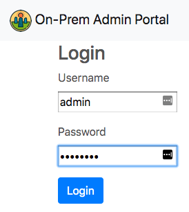
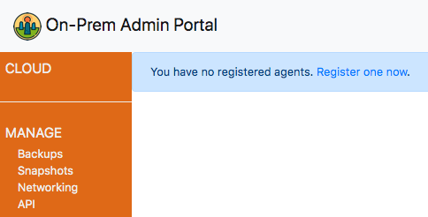
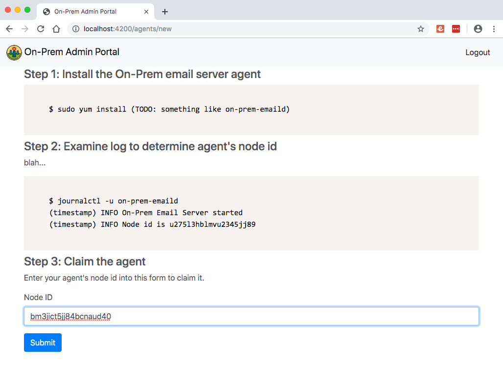
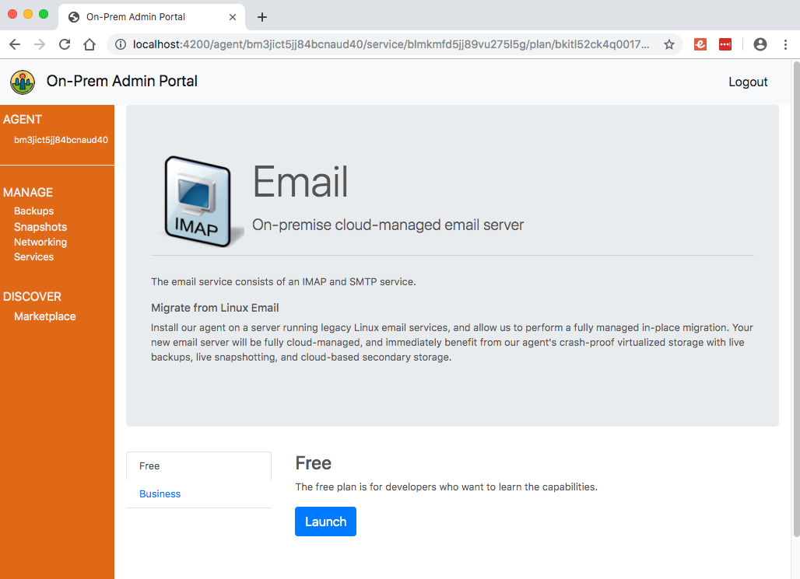

# On-Prem Email Server

A modern on-premise open source email server.

## Project Goals

1. On-premise, cloud-managed
2. Operator-less storage and live snapshots
3. Effortless migration

## Docs

* [Project goals](./docs/Goals.md) (elaborated)
* What about [SpamAssassin?](./docs/SpamAssassin.md)
* What about [Roundcube?](./docs/Roundcube.md)

## Building

```sh
$ make
```

### After changing a model or proto file

```sh
$ make generate
$ make
```

## Testing

```sh
$ make check
```

## Running

```sh
$ make
$ cd $GOPATH/bin
$ ./on-prem-emaild
2019/09/22 02:05:25 INFO Opened database /.../on-prem-emaild.db
2019/09/22 02:05:25 DEBUG Ensuring indexes
2019/09/22 02:05:25 INFO Listening for IMAP4rev1 on :8143
2019/09/22 02:05:25 DEBUG Connected to wss://api.on-prem.net/v1/agentStream
2019/09/22 02:05:25 INFO On-Prem Email Server started
2019/09/22 02:05:25 INFO Node id is bm3jict5jj84bcnaud40
```

Then visit the Admin Portal at [https://console.on-prem.net](https://console.on-prem.net).

## Running with a local Admin Portal

Begin by cloning, building, and running the [On-Prem Admin Portal API Server](git@github.com:Megalithic-LLC/on-prem-admin-api.git):

```sh
$ git clone git@github.com:Megalithic-LLC/on-prem-admin-api.git
...
$ make
$ cd $GOPATH/bin
$ ./on-prem-admin-api
2019/09/22 01:56:10 INFO Attached to MySQL
2019/09/22 01:56:10 INFO Completed migrations
2019/09/22 01:56:10 INFO Attached to Redis at localhost:6379
2019/09/22 01:56:10 INFO Listening for http on port 3000
2019/09/22 01:56:10 INFO On-Prem Admin API started
```

Then start the email server in this project with:

```sh
$ make
$ cd $GOPATH/bin
$ ./on-prem-emaild
2019/09/22 02:05:25 INFO Opened database /.../on-prem-emaild.db
2019/09/22 02:05:25 DEBUG Ensuring indexes
2019/09/22 02:05:25 INFO Listening for IMAP4rev1 on :8143
2019/09/22 02:05:25 DEBUG Connected to ws://localhost:3000/v1/agentStream
2019/09/22 02:05:25 INFO On-Prem Email Server started
2019/09/22 02:05:25 INFO Node id is bm3jict5jj84bcnaud40
```

Finally, clone and run the [On-Prem Admin Portal UI](git@github.com:Megalithic-LLC/on-prem-admin-ui.git), and login:

```sh
$ git clone git@github.com:Megalithic-LLC/on-prem-admin-ui.git
$ cd on-prem-admin-ui
$ npm install
$ ember serve --proxy=http://localhost:3000
Proxying to http://localhost:3000

Build successful (8113ms) – Serving on http://localhost:4200/
```

## Using Admin Portal



After logging in with the default credentials of `admin` and `password`, you'll be prompted to the effect that you haven't registered any agents yet. 



Claim the running emaild agent by finding its node id in its startup log, and entering it into the admin ui:



Finally, once the agent is selected, go to the marketplace, find the email service offering, select the free plan, and launch it to create a service instance and site configuration for your agent.



## Design

### Storage

The [BoltDB](https://github.com/etcd-io/bbolt) and [BadgerDB](https://github.com/dgraph-io/badger) storage engines are supported, with BoltDB currently being the hard-coded default. [Genji](https://github.com/asdine/genji) is used as a layer above the storage engines to manage secondary indexes, and provides a data access interface.

### Configuration and connection to Admin Portal

The email server is configuration-free (no local config files, no local operator interface), and obtains its configuration updates from the Administration Portal API Server. A Websocket connection is maintained, and protobuf messages are exchanged using a request-response handshake involving request id's.
