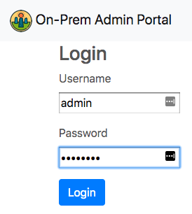

# On-Prem Email Server

A modern on-premise open source email server.

## Project Goals

1. On-premise, cloud-managed
2. Operator-less storage and live snapshots
3. Effortless migration

## Docs

* [Project goals](./docs/Goals.md) (elaborated)
* [SpamAssassin](./docs/SpamAssassin.md)
* [Roundcube](./docs/Roundcube.md)

## Building

```sh
$ make
```

## Running

Begin by cloning and building the [On-Prem Admin Portal API Server](git@github.com:Megalithic-LLC/on-prem-admin-api.git):

```sh
$ make
$ cd $GOPATH/bin
$ ./on-prem-admin-api
2019/09/22 01:56:10 INFO Attached to MySQL
2019/09/22 01:56:10 INFO Completed migrations
2019/09/22 01:56:10 INFO Attached to Redis at localhost:6379
2019/09/22 01:56:10 INFO Listening for http on port 3000
2019/09/22 01:56:10 INFO On-Prem Admin API started
```

Then start the email server in this project with:

```sh
$ make
$ cd $GOPATH/bin
$ ./on-prem-emaild
2019/09/22 02:05:25 INFO Opened database /.../on-prem-emaild.db
2019/09/22 02:05:25 DEBUG Ensuring indexes
2019/09/22 02:05:25 INFO Listening for IMAP4rev1 on :8143
2019/09/22 02:05:25 DEBUG Connected to ws://localhost:3000/v1/agentStream
2019/09/22 02:05:25 INFO On-Prem Email Server started
2019/09/22 02:05:25 INFO Node id is bm3jict5jj84bcnaud40
```

Finally, clone and run the [On-Prem Admin Portal UI](git@github.com:Megalithic-LLC/on-prem-admin-ui.git), and login with the default credentials of `admin` and `password`:

```sh
$ npm install
$ ember serve --proxy=http://localhost:3000
Proxying to http://localhost:3000

Build successful (8113ms) – Serving on http://localhost:4200/
```


